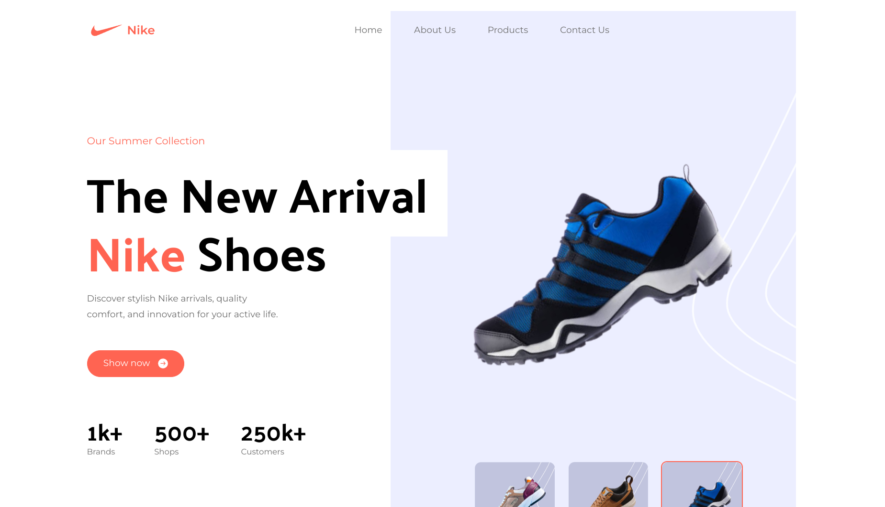
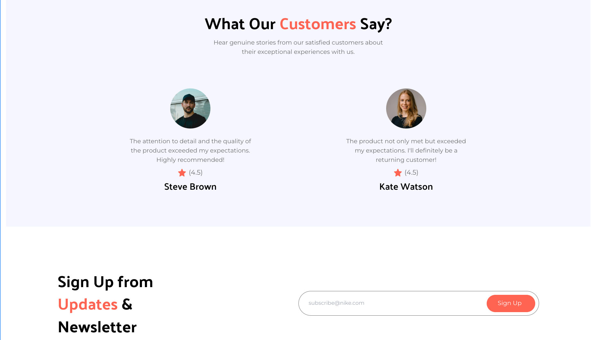
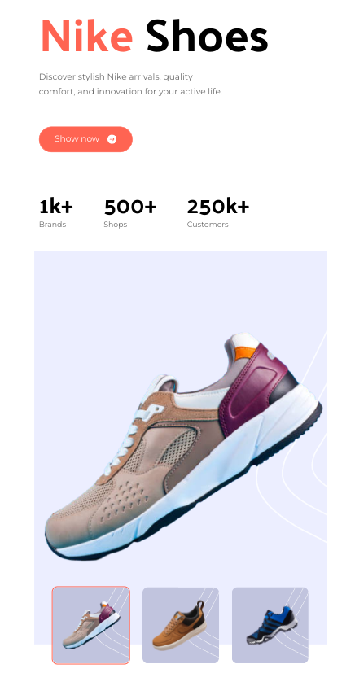
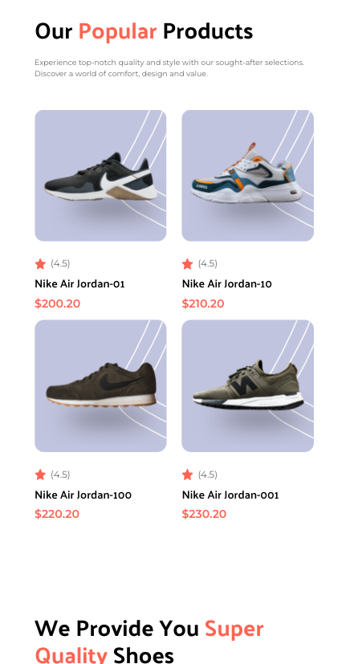
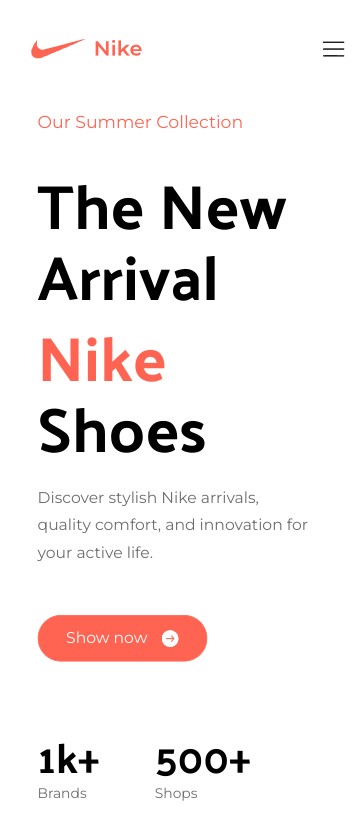
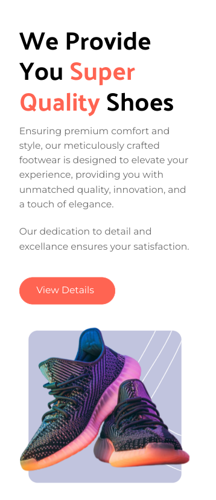

## Introduction:
- This project is a responsive and dynamic frontend for a Nike-themed project using Reactjs and Tailwind css.
- The main goal of the project is to create visually appealing and responsive website so that it can provide good user experience for devices with different aspect ratios.
- This project is fully based on Nike's branding and style.

## Feature
- Responsive Design
- Modern UI components
- Interactive elements
- Smooth animations (currently unavailable)
- Minimalistic look

## Screenshots
Screenshots of the website:-
### Desktop

### Tablet

### Mobile

## Features To be added:
- Functionality for burger icon
- scrollable customer review cards
- Product page for each product cards
- Animation on Hover and scroll

## Contact
If you have any questions or feddback, feel free to reach out
Checkout my profile for my social media handles.